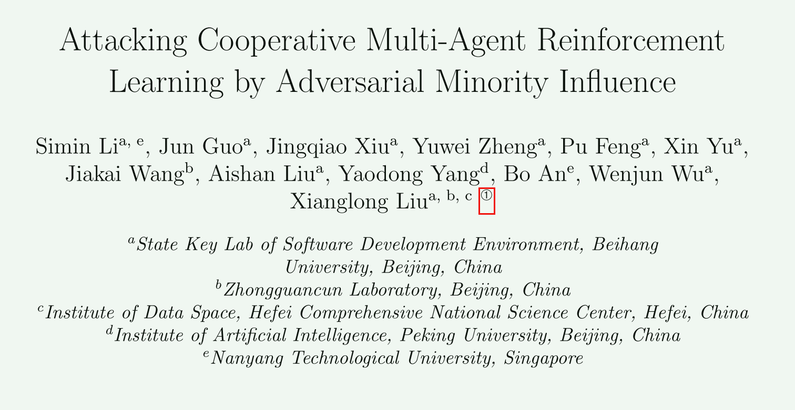

## 1. Neural Networks 2024

这一篇论文，扩展了之前Gleave的论文，将adversarial attack扩展到了cMARL。具体的想法是，在Gleave的基础上，给奖励函数新加一项，鼓励attacker的行动能够影响victim，使得victim采取不利于后续结果的行为。

具体的实现分为两个模块：

#### 首先，attacker的行为应当提高victim的熵值而不是降低，这是由于victim本身具有一定协作功能，所以victim正常情况下的策略是比较确定的，如果引入了attacker，victim的行为依然比较确定，就可能是attacker被victim同化，一起执行任务。提高victim的熵值就可以认为是鼓励victim的分布为均匀分布。

#### 然而这样的效果并不会最优，因为均匀分布未必会使victim的性能降低到最低。于是同步训练一个Agent来输出victim的在每个状态下的最差动作。attacker和Agent同步进行训练，Agent提供的分布可以代替均匀分布，成为训练奖励的另一项（与Gleave相比改进的一项）。