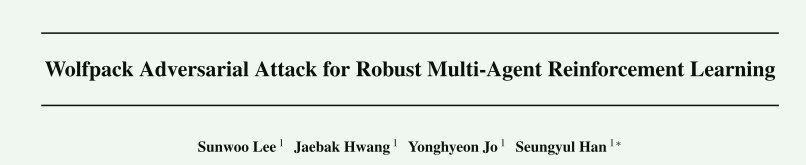
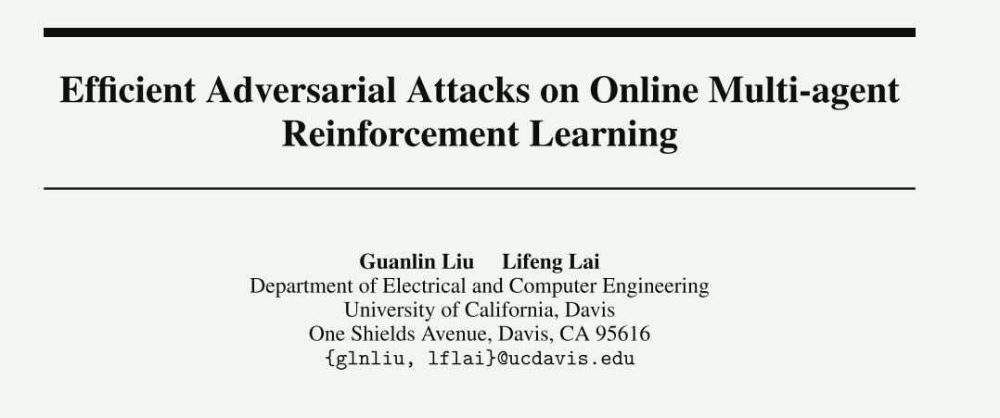

## 1. Neural Networks 2024

这一篇论文，扩展了之前Gleave的论文，将adversarial attack扩展到了cMARL。具体的想法是，在Gleave的基础上，给奖励函数新加一项，鼓励attacker的行动能够影响victim，使得victim采取不利于后续结果的行为。

具体的实现分为两个模块：

#### 首先，attacker的行为应当提高victim的熵值而不是降低，这是由于victim本身具有一定协作功能，所以victim正常情况下的策略是比较确定的，如果引入了attacker，victim的行为依然比较确定，就可能是attacker被victim同化，一起执行任务。提高victim的熵值就可以认为是鼓励victim的分布为均匀分布。

#### 然而这样的效果并不会最优，因为均匀分布未必会使victim的性能降低到最低。于是同步训练一个Agent来输出victim的在每个状态下的最差动作。attacker和Agent同步进行训练，Agent提供的分布可以代替均匀分布，成为训练奖励的另一项（与Gleave相比改进的一项）。

### 这篇论文可以继续往下研究：改论文并没有完全的理清多智能体之间的协作关系，并且该论文也没有解决如何将攻击者的数量扩展的问题。

## 2. ICML 2025

这篇论文模拟了狼群攻击的方式来攻击MARL，具体来说，选择一个victim进行攻击，后续对收到这次攻击影响采取重要行动的victim进行攻击，从而使得整个任务失败。后续攻击目标的选择根据攻击前后agent自有的值函数的变化来确定，选择变化大的作为后续攻击目标。攻击时刻的选择，根据对攻击前后全局值函数的变化之和来决定。由于涉及到多步预测来获取整个攻击过程中全局值函数的变化之和，所以使用transformer来对状态转移做了拟合。

## 3. NeurIPS 2023

一篇理论性论文。讨论了对MARL的两种攻击方式，一种是对action修改另一种是对reward进行修改，来使得victims的策略服从一个目标策略或者是最大化修改后的奖励。

文章通过理论证明了若干结论：

#### 仅通过以上两种方式中的任一一个，在限制了攻击效率为o(T)时，并不能保证能够使得victims服从任意的策略

#### 文章给出了上一条结论成立的充分条件（对目标策略的限制）

#### 通过上述两种方式的混合攻击，是可以在保证攻击效率的同时还保证victims服从任意的策略
